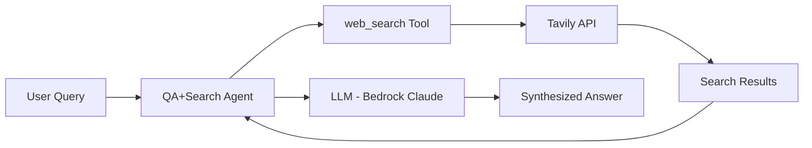

# Evaluation Plan for QA+Search Agent

## 1. Evaluation Requirements

- **User Input:** `"evaluate my qa agent at ./qa_agent for its answer faithfulness to search results"`
- **Interpreted Evaluation Requirements:**
  - Primary focus on **answer faithfulness**: Evaluate how well the agent's responses align with and are grounded in the search results retrieved from Tavily
  - Assess whether answers contain accurate information from search results without hallucination or fabrication
  - Verify that answers cite and utilize the actual content returned by web searches

---

## 2. Agent Analysis

| **Attribute**         | **Details**                                                                                          |
| :-------------------- | :--------------------------------------------------------------------------------------------------- |
| **Agent Name**        | QA+Search                                                                                            |
| **Purpose**           | Answer user queries by performing web searches via Tavily and synthesizing responses from results    |
| **Core Capabilities** | Web search via Tavily API, information retrieval, answer synthesis from search results               |
| **Input**             | Natural language query string (e.g., "recent ai news")                                               |
| **Output**            | Natural language answer synthesized from search results                                              |
| **Agent Framework**   | Strands Agent framework                                                                              |
| **Technology Stack**  | Python, Strands Agents, Tavily Python SDK, AWS Bedrock (Claude Sonnet)                              |

**Agent Architecture Diagram:**



**Key Components:**

- **QA+Search Agent:** Main Strands Agent that orchestrates query processing, tool usage, and answer generation using AWS Bedrock Claude Sonnet
- **web_search Tool:** Custom tool function that interfaces with Tavily API to retrieve search results (title, URL, content, score)
- **Tavily Client:** External search API integration that returns up to 5 results per query with content snippets

**Available Tools:**

- **web_search:** Searches the web using Tavily API with configurable parameters (query, max_results: 0-20, news: bool). Returns list of results containing title, URL, content snippet, and relevance score.

**Observability Status**

- **Tracing Framework:** Fully Instrumented (Strands Telemetry with OTLP exporter)
- **Custom Attributes:** No (relying on Strands automatic instrumentation)

---

## 3. Evaluation Metrics

### Faithfulness Score

- **Evaluation Area:** Final response quality - grounding in retrieved evidence
- **Description:** Measures whether the agent's answer is factually consistent with and grounded in the search results retrieved from Tavily. Evaluates if claims made in the answer can be verified against the actual search result content without introducing hallucinations or unsupported statements.
- **Method:** LLM-as-Judge using DeepEval's FaithfulnessMetric, which analyzes claims in the answer against the retrieved context (search results)

### Answer Relevancy

- **Evaluation Area:** Final response quality - relevance to query
- **Description:** Measures how well the agent's answer addresses the original user query. Ensures the agent not only grounds answers in search results but also provides information that directly responds to what was asked.
- **Method:** LLM-as-Judge using DeepEval's AnswerRelevancyMetric, which evaluates semantic relevance between query and response

---

## 4. Test Data Generation

- **General Information Queries**: Questions requiring factual information from web searches (e.g., "What are the latest developments in AI?", "Who won the 2024 Nobel Prize in Physics?"). Tests basic search and synthesis capabilities with straightforward queries.
- **Current Events Queries**: Time-sensitive questions about recent news or events (e.g., "Recent AI news", "Latest technology announcements"). Tests the agent's ability to retrieve and synthesize current information with news flag enabled.
- **Total number of test cases**: 2

---

## 5. Evaluation Implementation Design

### 5.1 Evaluation Code Structure

```
./                           # Repository root directory
├── requirements.txt         # Consolidated dependencies
├── .venv/                   # Python virtual environment (created by uv)
│
└── eval/                    # Evaluation workspace
    ├── README.md            # Running instructions and usage examples
    ├── metrics.py           # Faithfulness and relevancy metrics using DeepEval
    ├── agent_runner.py      # Runs QA agent against test cases, collects search results and answers
    ├── run_evaluation.py    # Main evaluation orchestration script
    ├── results/             # Evaluation outputs (JSON results, metric scores)
    ├── eval-plan.md         # This evaluation specification and plan
    ├── test-cases.jsonl     # Generated test cases (from /evalkit.data)
    │
    └── traces/              # Processed trace files for evaluation
        └── <traceId>.json   # Individual processed trace files (from trace-processor.py)
```

### 5.2 Recommended Evaluation Technical Stack

| **Component**            | **Selection**                                               |
| :----------------------- | :---------------------------------------------------------- |
| **Language/Version**     | Python 3.11+                                                |
| **Tracing Libraries**    | Strands Telemetry (native Strands tracing support)         |
| **OTEL Infrastructure**  | Local collector with file export                            |
| **Evaluation Libraries** | DeepEval (FaithfulnessMetric, AnswerRelevancyMetric)        |
| **LLM Service**          | LiteLLM                                                     |
| **LLM Provider**         | AWS Bedrock                                                 |
| **LLM Model**            | us.anthropic.claude-sonnet-4-20250514-v1:0                  |
| **Agent Integration**    | Direct Python import from qa_agent.qa_agent module          |
| **Results Storage**      | JSON files in eval/results/                                 |

---

## 6. Progress Tracking

### 6.1 User Requirements Log

| **Timestamp**      | **Source**      | **Requirement**                                                                         |
| :----------------- | :-------------- | :-------------------------------------------------------------------------------------- |
| 2025-11-20 00:00   | `/evalkit.plan` | Evaluate QA agent for answer faithfulness to search results                             |

### 6.2 Evaluation Progress

| **Timestamp**      | **Component**        | **Status**     | **Notes**                                                   |
| :----------------- | :------------------- | :------------- | :---------------------------------------------------------- |
| 2025-11-20 00:00   | Evaluation Plan      | Completed      | Initial plan created focusing on faithfulness metrics       |
| 2025-11-20 00:00   | Agent Analysis       | Completed      | Analyzed Strands-based QA agent with Tavily integration     |
| 2025-11-20 21:19   | Test Data Generation | Completed      | Generated 2 test cases covering both scenarios in JSONL     |
| 2025-11-20 21:21   | Tracing Setup        | Completed      | Added Strands Telemetry instrumentation with OTLP exporter  |
| 2025-11-20 21:31   | Agent Execution      | Completed      | Ran 2 test cases, collected and processed 2 trace files     |
| 2025-11-20 21:51   | Evaluation Implementation | Completed | Implemented metrics with LiteLLM+Bedrock, executed evaluation |
| 2025-11-20 21:58   | Results Analysis & Report | Completed | Generated comprehensive evaluation report with recommendations |
