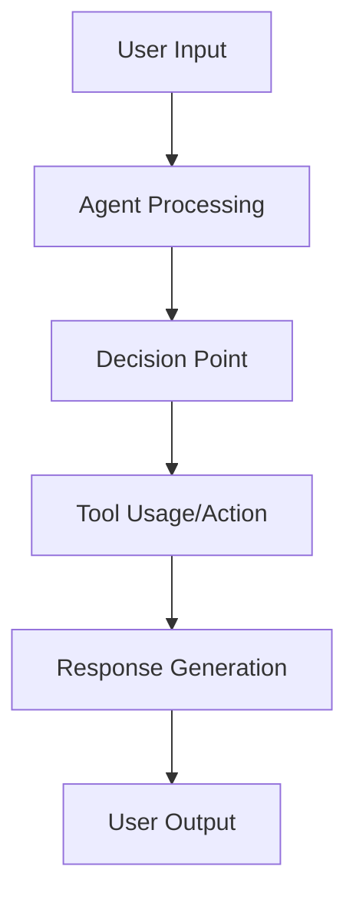

# Agent Evaluation Specification: [AGENT NAME]

**Branch**: `[###-eval-pipeline]` | **Date**: [DATE]    
**User Input**: "$ARGUMENTS"    
**User Evaluation Requests**: [Parsed from user input - highest priority, or NA]    
**Agent Path**: `[Path to agent code/repository, or No agent source code found]`    
**Test Case Path**: `[Path to existing agent test cases, or No existing test cases found]`    
**Trace Path**: `[Path to existing agent execution traces, or No existing traces found]`    
**Design Path**: `[Path to evaluation design document]`   

**Note**: This template is filled in by the `/evalkit.design` command. See `.evalkit/templates/commands/design.md` for the execution workflow.

## Agent Analysis & Overview
<!--
  IMPORTANT: Agent analysis should be PRIORITIZED as evaluation areas ordered by importance.
  Each evaluation area must be INDEPENDENTLY TESTABLE - meaning if you implement just ONE of them,
  you should still have a viable evaluation that delivers meaningful insights.
  
  Assign priorities (P1, P2, P3, etc.) to each area, where P1 is the most critical.
  Think of each area as a standalone slice of evaluation that can be:
  - Evaluated independently
  - Tested independently
  - Reported independently
-->

### Agent Architecture & Capabilities

**Agent Type**: [e.g., Conversational, RAG, Tool-using, Code generation]    
**Input/Output Formats**: [Describe data types and interaction patterns]  
**Key Functions**: [List primary capabilities and decision points]  
**Available Tools**: [If applicable, list tools the agent can use]  
**Technology Stack**: [Languages, frameworks, dependencies]


### Tracing Instrumentation and Assets Analysis

**Detected Instrumentation Status**: [Fully/Partially/Not Instrumented - tracing libraries found]   
**Available Assets**: [Existing traces/test cases/source code only]   
**Default Implementation Scenario**:
Based on the target agent's current state and available assets, the marked option is suggested as the most appropriate evaluation approach. Each scenario determines which implementation modules will be included in your evaluation pipeline:
<!--
  ACTION REQUIRED: Select and mark with x
-->
- [ ] **Instrumented agent + existing traces** → Core evaluation pipeline only (fastest setup - analyze existing trace data)
- [ ] **Instrumented agent + test cases** → Trace collection + core evaluation pipeline (run tests to generate new traces, then evaluate)
- [ ] **Instrumented agent only** → Test generation + trace collection + core evaluation pipeline (full pipeline - create tests, collect traces, evaluate)
- [ ] **Agent without instrumentation** → Instrumentation guidance + full pipeline (complete setup - add tracing, create tests, collect traces, evaluate)
- [ ] **Traces only** → Trace analysis + core evaluation pipeline (analyze existing traces without agent access)

**Agent Workflow Diagram**:

<!--
  ACTION REQUIRED: Replace the generic workflow above with your agent's specific flow, showing key decision points, tool usage, and data transformations.
-->

## Evaluation Areas
<!--
  IMPORTANT: Focus on user evaluation requests. Do not over-complicate.
  - Prioritize what the user specifically asked for in their evaluation requests
  - Propose minimal evaluation areas that satisfy their needs
  - Avoid suggesting too many evaluation areas - keep it focused and achievable
  - Each area must be independently testable and deliver clear value
-->


### Evaluation Area 1 - [Brief Title] (Priority: P1)

[Describe this evaluation focus in plain language]

**Why this priority**: [Explain the value and why it has this priority level]

**Independent Test**: [Describe how this can be evaluated independently - e.g., "Can be fully tested by [specific scenarios] and delivers [specific insights]"]

**Metrics**:
<!--
  IMPORTANT: Keep metrics minimal - 1-2 focused metrics maximum.
  Do not propose many metrics. Focus on what directly measures the evaluation area's core value.
-->
1. **Metric**: [specific measurement]
2. **Metric**: [specific measurement]

---
<!--
  IMPORTANT: Add more evaluation areas as needed, each with an assigned priority. Remember to keep minimal - only add if truly necessary for user's evaluation requests.
-->

### Key Test Scenarios
<!--
  ACTION REQUIRED: Fill out key test scenarios if evaluation involves specific test cases (content below represents placeholders), or remove this entire "Key Test Scenarios" section as scenarios if existing test cases or traces are found.
-->

- **[Scenario Type 1]**: [What it tests, key characteristics without implementation]
- **[Scenario Type 2]**: [What it tests, relationships to other scenarios]

### Edge Cases & Failure Modes
<!--
  ACTION REQUIRED: Fill out the edge cases for agent evaluation (content below represents placeholders), or remove this entire "Edge Cases & Failure Modes" section if existing test cases or traces are found.
-->

- What happens when [agent receives ambiguous input]?
- How does agent handle [out-of-scope requests]?
- What occurs during [API failures or timeouts]?


## Implementation Plan
<!--
  IMPORTANT: This section defines the technical implementation approach for the evaluation infrastructure.
  Focus on practical decisions that enable trace-based evaluation of the agent.
-->

### Required Implementation Modules

Based on user evaluation requests, tracing instrumentation status, and available assets, the following marked modules are suggested as required:
<!--
  ACTION REQUIRED: Select and mark with x
-->
- [ ] Instrumentation Guidance (if agent lacks tracing)
- [ ] Test Case Generation Module (if no test cases available/requested)
- [ ] Trace Collection Module (if instrumented but no traces available/requested)
- [ ] Core Evaluation Pipeline Module (always required)

### Technical Stack

**Language/Version**: [e.g., Python 3.11, Node.js 18+]   
**Tracing Libraries**: [e.g., Langfuse, OpenTelemetry]  
**Evaluation Libraries**: [e.g., DeepEval, RAGAS, Custom]   
**Agent Integration**: [e.g., Direct import, API]   
**Data Storage**: [e.g., JSONL/JSON files]  
**Visualization**: [e.g., Streamlit dashboard]  

### Core Architecture

**Evaluation Pipeline**: [e.g., Sequential processing vs parallel execution - approach and rationale]   
**Configuration**: [e.g., YAML files for flexibility - configuration approach]  
**Error Handling**: [e.g., Graceful degradation vs fail-fast - error strategy]  
**Results Storage**: [e.g., JSON files for simplicity vs SQLite for queries - storage approach]

### File Structure
<!--
  ACTION REQUIRED: Adjust based on Required Implementation Modules
-->

```
eval/
├── config.yaml              # Configuration for evaluation framework (always present)
├── evaluators.py            # Core evaluation pipeline (always present)
├── run_evaluation.py        # Main orchestration script (always present)
├── results/                 # Evaluation outputs (always present)
├── eval-design.md           # This evaluation specification and plan (always present)
│
├── instrumentation_guide.md # Only when agent lacks instrumentation
├── test_generator.py        # When test generation needed
├── trace_collector.py       # When trace collection needed
└── traces/                  # When trace collection needed
```

### Implementation Tasks
<!--
  ACTION REQUIRED: Adjust based on tracing instrumentation and available assets analysis
-->

#### Setup Project Structure
<!--
  ACTION REQUIRED: Keep - always required
-->
- [ ] Create evaluation project structure based on the decided file structure
- [ ] Set up Python environment with dependencies (using uv by default)

#### Instrumentation Setup
<!--
  ACTION REQUIRED: Keep - only if agent lacks tracing instrumentation, otherwise remove
-->
- [ ] Create instrumentation guide documentation in `eval/instrumentation_guide.md`
- [ ] Enable tracing in agent code using selected instrumentation library

#### Test Case Generation
<!--
  ACTION REQUIRED: Keep - only if no existing test cases available, otherwise remove
-->
- [ ] Implement test case generator in `eval/test_generator.py`
- [ ] Generate comprehensive test scenarios covering all evaluation areas

#### Trace Collection
<!--
  ACTION REQUIRED: Keep - only if no existing traces available, otherwise remove
-->
- [ ] Implement trace collector in `eval/trace_collector.py`
- [ ] Set up trace storage and management in `eval/traces/`

#### Core Evaluation Logic
<!--
  ACTION REQUIRED: Keep - always required
-->
- [ ] Implement all evaluation area evaluators in `eval/evaluators.py`
- [ ] Build helper functions to extract required input-output pair for each evaluator
- [ ] Build main evaluation orchestration in `eval/run_evaluation.py`
- [ ] Add configuration management in `eval/config.yaml`

#### Results & Analysis
<!--
  ACTION REQUIRED: Keep - always required
-->
- [ ] Implement results aggregation and analysis
- [ ] Create visualization and reporting
- [ ] Set up results storage in `eval/results/`

#### Code Review & Testing
<!--
  ACTION REQUIRED: Keep - always required
-->
- [ ] Conduct code review to identify critical issues and fix
- [ ] Test end-to-end evaluation pipeline
- [ ] Validate all selected modules work together correctly

### Important Notes

- Focus on core evaluation logic, avoid over-engineering
- Each evaluation area should be testable independently within the unified implementation
- All evaluation uses actual agent execution (either existing traces or collected traces from trace collector), no simulation

## Evaluation Design Iteration Guide

If the suggested modules don't match your evaluation needs, try these scenario-specific requests:

**Scenario 1 - Focus on existing traces only:**
`/evalkit.design I want to evaluate my agent using only the existing traces in ./traces/ directory`

**Scenario 2 - Generate traces from existing test cases:**
`/evalkit.design I want to run my instrumented agent on existing test cases and evaluate the generated traces`

**Scenario 3 - Full evaluation pipeline:**
`/evalkit.design I want to generate test cases, collect traces, and evaluate my instrumented agent end-to-end`

**Scenario 4 - Add instrumentation first:**
`/evalkit.design My agent needs tracing instrumentation before evaluation - guide me through the complete setup`

**Scenario 5 - Analyze unknown traces:**
`/evalkit.design I have trace files but need to understand what agent capabilities they represent and evaluate them`

**Custom evaluation focus:**
`/evalkit.design I want to focus specifically on [accuracy/performance/safety/tool usage/reasoning] evaluation`

**Refine current design:**
You can manually edit this `eval-design.md` file to add/remove/modify specific modules, requirements, or focus areas as needed.

---

**Note**: Running `/evalkit.design` again will create a new evaluation branch and automatically remove the current `eval/` directory to start fresh. This allows you to iterate on your evaluation design with different approaches while preserving your work in separate branches.

