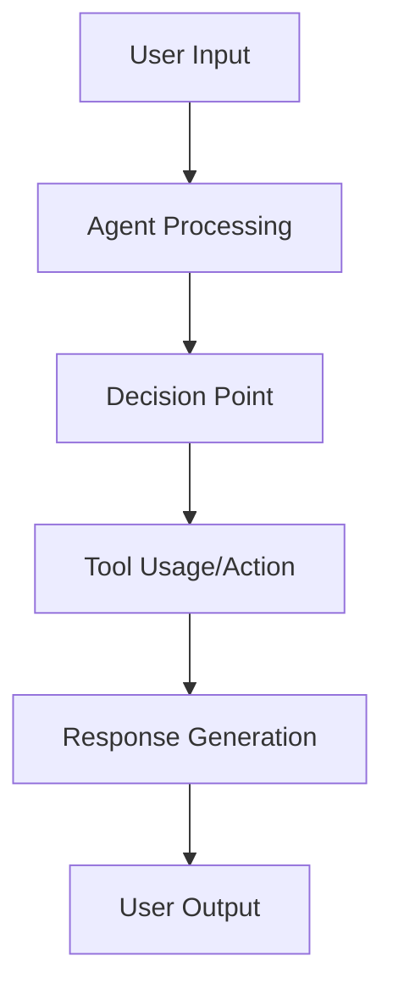

# Agent Evaluation Specification: [AGENT NAME]

**Branch**: `[###-eval-pipeline]` | **Date**: [DATE]    
**User Input**: "$ARGUMENTS"    
**User Evaluation Requests**: [Parsed from user input - highest priority, or NA]    
**Agent Path**: [Path to agent code/repository, or NA]  
**Test Case Path**: [Path to existing agent test cases, or NA]  
**Trace Path**: [Path to existing agent execution traces, or NA]    
**Design Path**: [Path to evaluation design document]   

**Note**: This template is filled in by the `/evalkit.design` command. See `.evalkit/templates/commands/design.md` for the execution workflow.

## Agent Analysis & Overview *(mandatory)*

<!--
  IMPORTANT: Agent analysis should be PRIORITIZED as evaluation areas ordered by importance.
  Each evaluation area must be INDEPENDENTLY TESTABLE - meaning if you implement just ONE of them,
  you should still have a viable evaluation that delivers meaningful insights.
  
  Assign priorities (P1, P2, P3, etc.) to each area, where P1 is the most critical.
  Think of each area as a standalone slice of evaluation that can be:
  - Evaluated independently
  - Tested independently
  - Reported independently
  - Demonstrated to stakeholders independently
-->

### Agent Architecture & Capabilities

**Agent Type**: [e.g., Conversational, RAG, Tool-using, Code generation]  
**Input/Output Formats**: [Describe data types and interaction patterns]  
**Key Functions**: [List primary capabilities and decision points]  
**Available Tools**: [If applicable, list tools the agent can use]  
**Technology Stack**: [Languages, frameworks, dependencies]

### Tracing Instrumentation and Assets Analysis

**Detected Instrumentation Status**: [Fully/Partially/Not Instrumented - tracing libraries found]
**Available Assets**: [Existing traces/test cases/source code only]
**Default Implementation Scenario**: [Select and mark with ★]
- [ ] Instrumented agent + existing traces → Core evaluation pipeline only
- [ ] Instrumented agent + test cases → Trace collection + core evaluation pipeline
- [ ] Instrumented agent only → Test generation + trace collection + core evaluation pipeline
- [ ] Agent without instrumentation → Instrumentation guidance + full pipeline
- [ ] Traces only → Trace analysis + core evaluation pipeline

**Note**: The module selection in Implementation Plan represents default suggestions based on detected agent state. If these don't match your evaluation goals, you can refine your evaluation by running `/evalkit.design` again with more specific requests or directly modify this document.

**Agent Workflow Diagram**:


*Note: Replace the generic workflow above with your agent's specific flow, showing key decision points, tool usage, and data transformations.*

### Evaluation Area 1 - [Brief Title] (Priority: P1)

[Describe this evaluation focus in plain language]

**Why this priority**: [Explain the value and why it has this priority level]

**Independent Test**: [Describe how this can be evaluated independently - e.g., "Can be fully tested by [specific scenarios] and delivers [specific insights]"]

**Metrics**:

1. **Metric**: [specific measurement] 
2. **Metric**: [specific measurement]

---

### Evaluation Area 2 - [Brief Title] (Priority: P2)

[Describe this evaluation focus in plain language]

**Why this priority**: [Explain the value and why it has this priority level]

**Independent Test**: [Describe how this can be evaluated independently]

**Metrics**:

1. **Metric**: [specific measurement]
2. **Metric**: [specific measurement]

---

[Add more evaluation areas as needed, each with an assigned priority]

### Edge Cases & Failure Modes

<!--
  ACTION REQUIRED: The content in this section represents placeholders.
  Fill them out with the right edge cases for agent evaluation.
-->

- What happens when [agent receives ambiguous input]?
- How does agent handle [out-of-scope requests]?
- What occurs during [API failures or timeouts]?

## Evaluation Requirements *(mandatory)*

<!--
  ACTION REQUIRED: The content in this section represents placeholders.
  Fill them out with the right evaluation requirements.
-->

### Functional Requirements

- **ER-001**: Evaluation MUST [specific capability, e.g., "measure response accuracy on test scenarios"]
- **ER-002**: Evaluation MUST [specific capability, e.g., "track execution time for all queries"]  
- **ER-003**: System MUST be able to [key measurement, e.g., "detect tool usage patterns"]
- **ER-004**: Evaluation MUST [data requirement, e.g., "store results for comparative analysis"]
- **ER-005**: System MUST [behavior, e.g., "log all agent interactions and responses"]

*Example of marking unclear requirements:*

- **ER-006**: Evaluation MUST measure quality via [NEEDS CLARIFICATION: quality metric not specified - accuracy, relevance, faithfulness?]
- **ER-007**: System MUST retain evaluation data for [NEEDS CLARIFICATION: retention period not specified]

### Key Test Scenarios *(include if evaluation involves specific test cases)*

- **[Scenario Type 1]**: [What it tests, key characteristics without implementation]
- **[Scenario Type 2]**: [What it tests, relationships to other scenarios]

## Implementation Plan *(mandatory)*

<!--
  This section defines the technical implementation approach for the evaluation infrastructure.
  Focus on practical decisions that enable trace-based evaluation of the agent.
-->

### Required Implementation Modules *(conditional)*

Based on user requests and agent state analysis: [Select and mark with ★]
- [ ] Instrumentation Guidance (if agent lacks tracing)
- [ ] Test Case Generation Module (if no test cases available/requested)
- [ ] Trace Collection Module (if instrumented but no traces available/requested)
- [ ] Core Evaluation Pipeline Module (always required)

### Technical Stack

**Language/Version**: [e.g., Python 3.11, Node.js 18+ or NEEDS CLARIFICATION]
**Evaluation Libraries**: [e.g., DeepEval, RAGAS, Custom or NEEDS CLARIFICATION]
**Agent Integration**: [e.g., Direct import or NEEDS CLARIFICATION]
**Data Storage**: [e.g., JSON/JSONL files or NEEDS CLARIFICATION]
**Visualization**: [e.g., Streamlit dashboard or NEEDS CLARIFICATION]

### Core Architecture

**Evaluation Pipeline**: [e.g., Sequential processing vs parallel execution - approach and rationale]
**Configuration**: [e.g., YAML files for flexibility - configuration approach]
**Error Handling**: [e.g., Graceful degradation vs fail-fast - error strategy]
**Results Storage**: [e.g., JSON files for simplicity vs SQLite for queries - storage approach]

### File Structure *(scenario-specific)*

```
eval/
├── config.yaml              # Configuration for evaluation framework (always present)
├── evaluators.py            # Core evaluation pipeline (always present)
├── run_evaluation.py        # Main orchestration script (always present)
├── results/                 # Evaluation outputs (always present)
├── eval-design.md           # This evaluation specification and plan (always present)
│
├── instrumentation_guide.md # Only when agent lacks instrumentation
├── test_generator.py        # When test generation needed
├── trace_collector.py       # When trace collection needed
└── traces/                  # When trace collection needed
```

### Implementation Tasks *(conditional based on selected modules)*

#### Setup Project Structure (Always Required)
- [ ] Create evaluation project structure based on the decided file structure
- [ ] Set up Python environment with dependencies (using uv by default)

#### Instrumentation Setup (If Required)
- [ ] Create instrumentation guide documentation in `eval/instrumentation_guide.md`
- [ ] Enable tracing in agent code using selected instrumentation library

#### Test Case Generation (If Required)
- [ ] Implement test case generator in `eval/test_generator.py`
- [ ] Generate comprehensive test scenarios covering all evaluation areas

#### Trace Collection (If Required)
- [ ] Implement trace collector in `eval/trace_collector.py`
- [ ] Set up trace storage and management in `eval/traces/`
- [ ] Configure trace collection pipeline with agent integration

#### Core Evaluation Logic (Always Required)
- [ ] Implement all evaluation area evaluators in `eval/evaluators.py`
- [ ] Build main evaluation orchestration in `eval/run_evaluation.py`
- [ ] Add configuration management in `eval/config.yaml`

#### Results & Analysis (Always Required)
- [ ] Implement results aggregation and analysis
- [ ] Create visualization and reporting
- [ ] Set up results storage in `eval/results/`

#### Code Review & Testing (Always Required)
- [ ] Conduct code review to identify critical issues and fix
- [ ] Test end-to-end evaluation pipeline
- [ ] Validate all selected modules work together correctly

### Important Notes

- Focus on core evaluation logic, avoid over-engineering
- Each evaluation area should be testable independently within the unified implementation
- All evaluation uses actual agent execution (either existing traces or collected traces from trace collector), no simulation

## Evaluation Design Iteration Guide *(always included)*

If the suggested modules don't match your evaluation needs, try these scenario-specific requests:

**Scenario 1 - Focus on existing traces only:**
`/evalkit.design I want to evaluate my agent using only the existing traces in ./traces/ directory`

**Scenario 2 - Generate traces from existing test cases:**
`/evalkit.design I want to run my instrumented agent on existing test cases and evaluate the generated traces`

**Scenario 3 - Full evaluation pipeline:**
`/evalkit.design I want to generate test cases, collect traces, and evaluate my instrumented agent end-to-end`

**Scenario 4 - Add instrumentation first:**
`/evalkit.design My agent needs tracing instrumentation before evaluation - guide me through the complete setup`

**Scenario 5 - Analyze unknown traces:**
`/evalkit.design I have trace files but need to understand what agent capabilities they represent and evaluate them`

**Custom evaluation focus:**
`/evalkit.design I want to focus specifically on [accuracy/performance/safety/tool usage/reasoning] evaluation`

**Refine current design:**
You can manually edit this `eval-design.md` file to add/remove/modify specific modules, requirements, or focus areas as needed.

---

**Note**: Running `/evalkit.design` again will create a new evaluation branch and automatically remove the current `eval/` directory to start fresh. This allows you to iterate on your evaluation design with different approaches while preserving your work in separate branches.

