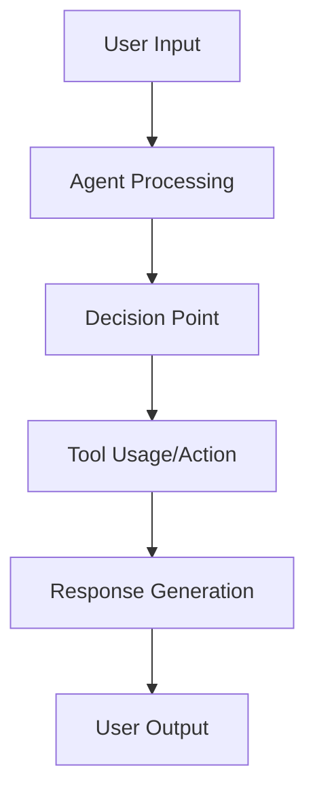

# Agent Evaluation Specification: [AGENT NAME]

**Branch**: `[###-eval-pipeline]` | **Date**: [DATE]    
**User Input**: "$ARGUMENTS"    
**User Evaluation Requests**: [Parsed from user input - highest priority, or NA]    
**Agent Path**: `[Path to agent code/repository, or No agent source code found]`    
**Test Case Path**: `[Path to existing agent test cases, or No existing test cases found]`    
**Trace Path**: `[Path to existing agent execution traces, or No existing traces found]`    
**Design Path**: `[Path to evaluation design document]`   

**Note**: This template is filled in by the `/evalkit.design` command. See `.evalkit/templates/commands/design.md` for the execution workflow.

## Agent Analysis & Overview
<!--
  IMPORTANT: Agent analysis should be PRIORITIZED as evaluation areas ordered by importance.
  Each evaluation area must be INDEPENDENTLY TESTABLE - meaning if you implement just ONE of them,
  you should still have a viable evaluation that delivers meaningful insights.
  
  Assign priorities (P1, P2, P3, etc.) to each area, where P1 is the most critical.
  Think of each area as a standalone slice of evaluation that can be:
  - Evaluated independently
  - Tested independently
  - Reported independently
-->

### Agent Architecture & Capabilities

**Agent Type**: [e.g., Conversational, RAG, Tool-using, Code generation]    
**Input/Output Formats**: [Describe data types and interaction patterns]  
**Key Functions**: [List primary capabilities and decision points]  
**Available Tools**: [If applicable, list tools the agent can use]  
**Technology Stack**: [Languages, frameworks, dependencies]

**Agent Workflow Diagram**:

<!--
  ACTION REQUIRED: Replace the generic workflow above with your agent's specific flow, showing key decision points, tool usage, and data transformations.
-->

### Tracing Instrumentation and Assets Analysis

**Detected Instrumentation Status**: [Fully/Partially/Not Instrumented - tracing libraries found]   
**Available Assets**: [Existing traces/test cases/source code only]   
**5-Command Workflow Strategy**:
Based on the target agent's current state and available assets, the marked option determines which commands are needed in your evaluation workflow:
<!--
  ACTION REQUIRED: Select and mark with x
-->
- [ ] **Instrumented agent + existing traces** → `/evalkit.implement` only (fastest setup - analyze existing trace data)
- [ ] **Instrumented agent + test cases** → `/evalkit.implement` only (evaluate with existing tracing and test cases)
- [ ] **Instrumented agent only** → `/evalkit.data` → `/evalkit.implement` (generate test cases and evaluate with existing tracing)
- [ ] **Agent without instrumentation** → `/evalkit.trace` → `/evalkit.data` → `/evalkit.implement` (full workflow - add tracing, create tests, evaluate)
- [ ] **Traces only** → `/evalkit.implement` only (analyze existing traces without agent access)

### Tracing Configuration
<!--
  ACTION REQUIRED: Fill out if agent needs tracing instrumentation
-->

**Target Library**: [Traceloop (default)/OpenTelemetry/Custom - specify based on agent architecture]    
**Instrumentation Points**: [Key functions/workflows to trace - e.g., main_execution, process_input, generate_response]   
**Collection Method**: [Local OTEL collector (default)/Cloud service]   
**Performance Impact**: [Expected overhead - Traceloop typically <5% performance impact]    

**Agent Integration Strategy**:
- **Default Traceloop Integration**: Use Traceloop decorators for evaluation-focused tracing
  - `@workflow`: Mark main agent execution flows for evaluation boundaries
  - `@task`: Mark individual reasoning/action steps for granular analysis
  - `@agent`: Mark agent decision points for performance measurement
- **Evaluation-Specific Naming**: Use descriptive span names that facilitate evaluation analysis
  - Example: `"agent_planning_phase"`, `"tool_execution_step"`, `"response_generation"`
- **Consistent App Naming**: Use format `"{agent-name}-eval-tracing"` for easy trace correlation

## Evaluation Areas
<!--
  IMPORTANT: Focus on user evaluation requests. Do not over-complicate.
  - Prioritize what the user specifically asked for in their evaluation requests
  - Propose minimal evaluation areas that satisfy their needs
  - Avoid suggesting too many evaluation areas - keep it focused and achievable
  - Each area must be independently testable and deliver clear value
-->


### Evaluation Area 1 - [Brief Title] (Priority: P1)

[Describe this evaluation focus in plain language]

**Why this priority**: [Explain the value and why it has this priority level]

**Independent Test**: [Describe how this can be evaluated independently - e.g., "Can be fully tested by [specific scenarios] and delivers [specific insights]"]

**Metrics**:
<!--
  IMPORTANT: Keep metrics minimal - 1-2 focused metrics maximum.
  Do not propose many metrics. Focus on what directly measures the evaluation area's core value.
-->
1. **Metric**: [specific measurement]
2. **Metric**: [specific measurement]

---
<!--
  IMPORTANT: Add more evaluation areas as needed, each with an assigned priority. Remember to keep minimal - only add if truly necessary for user's evaluation requests.
-->

### Key Test Scenarios
<!--
  ACTION REQUIRED: Fill out key test scenarios if evaluation involves specific test cases (content below represents placeholders), or remove this entire "Key Test Scenarios" section if existing test cases or traces are found.
-->

- **[Scenario Type 1]**: [What it tests, key characteristics without implementation]
- **[Scenario Type 2]**: [What it tests, relationships to other scenarios]

### Test Case Requirements
<!--
  ACTION REQUIRED: Fill out if test cases need to be generated, or remove this entire "Test Case Requirements" section if existing test cases or traces are found.
-->

**Generation Strategy**: [Scenario-based (default)/Coverage-based/Hybrid]   
**Test Case Format**: [JSONL with standardized schema (default)]    
**Coverage Targets**: [Evaluation areas that need test cases - reference evaluation areas above]    
**Expected Volume**: [Number of test cases needed - typically 5-10 based on evaluation scope]   


## Implementation Plan
<!--
  IMPORTANT: This section defines the technical implementation approach for the evaluation infrastructure.
  Focus on practical decisions that enable trace-based evaluation of the agent.
-->

### Required Commands and Modules

Based on user evaluation requests, tracing instrumentation status, and available assets, the following commands and modules are suggested:
<!--
  ACTION REQUIRED: Select and mark with x based on 5-Command Workflow Strategy above
-->
- [ ] `/evalkit.trace` - Tracing instrumentation setup (if agent lacks tracing)
- [ ] `/evalkit.data` - Test case generation (if no test cases available/requested)
- [ ] `/evalkit.implement` - Core evaluation pipeline (always required)
- [ ] `/evalkit.insights` - Results analysis (optional after evaluation execution)

**Command Execution Order**: `design` → `trace` (if needed) → `data` (if needed) → `implement` → `insights` (if needed)

### Technical Stack

**Language/Version**: [e.g., Python 3.11, Node.js 18+]  
**Tracing Libraries**: [e.g., Traceloop (default), OpenTelemetry]   
**OTEL Infrastructure**: [Local collector with file export (default)]   
**Evaluation Libraries**: [e.g., DeepEval (default), RAGAS, Custom]   
**Agent Integration**: [e.g., Direct import, API]   
**Data Storage**: [e.g., JSONL/JSON files]    

### Core Architecture

**Evaluation Pipeline**: [e.g., Sequential processing vs parallel execution - approach and rationale]   
**Configuration**: [e.g., YAML files for flexibility - configuration approach]  
**Error Handling**: [e.g., Graceful degradation vs fail-fast - error strategy]  
**Results Storage**: [e.g., JSON files for simplicity vs SQLite for queries - storage approach]

### File Structure
<!--
  ACTION REQUIRED: Adjust based on Required Implementation Modules
-->

```
eval/
├── config.yaml              # Configuration for evaluation framework (always present)
├── evaluators.py            # Core evaluation pipeline (always present)
├── run_evaluation.py        # Main orchestration script (always present)
├── results/                 # Evaluation outputs (always present)
├── eval-design.md           # This evaluation specification and plan (always present)
│
├── setup_otelcol.sh         # OTEL collector setup (from /evalkit.trace)
├── run_otelcol.sh           # OTEL collector runner (from /evalkit.trace)
├── otel-config.yaml         # OTEL collector config (from /evalkit.trace)
└── test-cases.jsonl         # Generated test cases (from /evalkit.data)
```

### Implementation Tasks
<!--
  ACTION REQUIRED: Adjust based on Required Commands and Modules above
-->

#### Tracing Setup Tasks (use `/evalkit.trace`)
<!--
  ACTION REQUIRED: Keep - only if agent lacks tracing instrumentation, otherwise remove
-->
- [ ] Copy OTEL templates to workspace (`setup_otelcol.sh`, `run_otelcol.sh`, `otel-config.yaml`)
- [ ] Download and setup OTEL collector binary
- [ ] Instrument agent code with selected tracing library (Traceloop default)
- [ ] Test tracing setup and validate trace collection
- [ ] Create tracing documentation in `eval/tracing-setup.md`

#### Test Case Generation Tasks (use `/evalkit.data`)
<!--
  ACTION REQUIRED: Keep - only if no existing test cases available, otherwise remove
-->
- [ ] Parse evaluation design for test scenario requirements
- [ ] Generate minimal test cases in JSONL format (`eval/test-cases.jsonl`)
- [ ] Validate test case coverage across all evaluation areas

#### Core Evaluation Tasks (use `/evalkit.implement`)
<!--
  ACTION REQUIRED: Keep - always required
-->
- [ ] Create evaluation project structure based on the decided file structure
- [ ] Implement all evaluation area evaluators in `eval/evaluators.py`
- [ ] Build helper functions to extract required input-output pair for each evaluator
- [ ] Build main evaluation orchestration in `eval/run_evaluation.py`
- [ ] Add configuration management in `eval/config.yaml`
- [ ] Integrate with tracing data and test cases
- [ ] Set up results storage in `eval/results/`
- [ ] Set up Python environment with dependencies (using uv by default)

#### Results Analysis Tasks (use `/evalkit.insights`)
<!--
  ACTION REQUIRED: Keep - always required
-->
- [ ] Implement results aggregation and analysis
- [ ] Create visualization and reporting
- [ ] Generate actionable improvement recommendations
- [ ] Create insights report with evidence-based findings

#### Final Validation Tasks
<!--
  ACTION REQUIRED: Keep - always required
-->
- [ ] Conduct code review to identify critical issues and fix
- [ ] Test end-to-end evaluation pipeline across all commands
- [ ] Validate command integration and data flow
- [ ] Verify all selected commands work together correctly

### Important Notes

- Focus on core evaluation logic, avoid over-engineering
- Each evaluation area should be testable independently within the unified implementation
- All evaluation uses actual agent execution (either existing traces or collected traces from trace collector), no simulation

## Evaluation Design Iteration Guide

If the suggested command workflow doesn't match your evaluation needs, try these scenario-specific requests:

**Scenario 1 - Focus on existing traces only:**
`/evalkit.design I want to evaluate my agent using only the existing traces in ./traces/ directory`
→ Workflow: `design` → `implement` → `insights`

**Scenario 2 - Generate test cases for instrumented agent:**
`/evalkit.design I want to generate test cases and evaluate my already-instrumented agent`
→ Workflow: `design` → `data` → `implement` → `insights`

**Scenario 3 - Full evaluation pipeline:**
`/evalkit.design I want to add tracing, generate test cases, and evaluate my agent end-to-end`
→ Workflow: `design` → `trace` → `data` → `implement` → `insights`

**Scenario 4 - Add instrumentation only:**
`/evalkit.design My agent needs tracing instrumentation before evaluation - guide me through setup only`
→ Workflow: `design` → `trace` (then continue with other commands as needed)

**Scenario 5 - Analyze unknown traces:**
`/evalkit.design I have trace files but need to understand what agent capabilities they represent and evaluate them`
→ Workflow: `design` → `implement` → `insights`

**Custom evaluation focus:**
`/evalkit.design I want to focus specifically on [accuracy/performance/safety/tool usage/reasoning] evaluation`

**Command-specific refinements:**
- **Tracing focus**: `/evalkit.design Focus on tracing setup with [specific library/requirements]`
- **Test case focus**: `/evalkit.design Generate test cases for [specific scenarios/edge cases]`
- **Implementation focus**: `/evalkit.design Implement evaluation for [specific metrics/frameworks]`

**Refine current design:**
You can manually edit this `eval-design.md` file to add/remove/modify specific commands, requirements, or focus areas as needed.

---

**Note**: Running `/evalkit.design` again will create a new evaluation branch and automatically remove the current `eval/` directory to start fresh. This allows you to iterate on your evaluation design with different approaches while preserving your work in separate branches.

