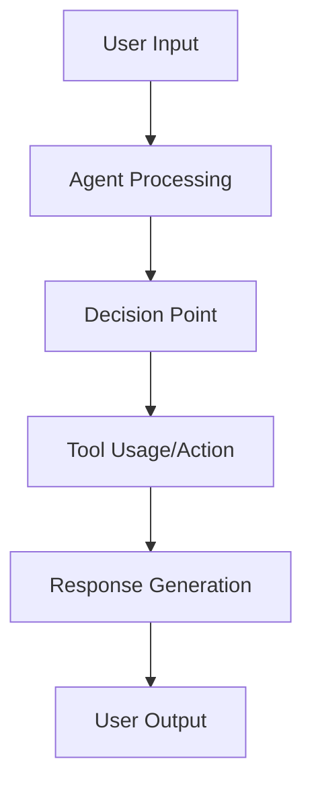

# Agent Evaluation Plan: [AGENT NAME]

**Branch:** `[###-eval-pipeline]` | **Date:** `[DATE]`

## User Requirements
- **User Input:** `"$ARGUMENTS"`
- **User Requests:** [Parsed from user input - highest priority, or "Not found"]


## Available Assets

| **Asset Type** | **Path** |
|:--------------|:------|
| **Agent Code** | [Path to agent code/repository, or "Not found"] |
| **Test Cases** | [Path to existing test cases, or "Not found"] |
| **Traces** | [Path to existing traces, or "Not found"] |


## Agent Architecture & Capabilities
<!--
  IMPORTANT: Analyze the agent's architecture, capabilities, and workflow to understand what needs evaluation.
-->
### Agent Description
[Brief description of what the agent is designed to do, and how the agent typically processes requests and generates responses - 2-3 sentences]

| **Attribute** | **Details** |
|:-----------------|:---------------|
| **Agent Type** | [e.g., Conversational, RAG, Tool-using, Code generation] |
| **Input/Output** | [Describe data types and interaction patterns] |
| **Key Functions** | [List primary capabilities and decision points] |
| **Available Tools** | [If applicable, list tools the agent can use] |
| **Tracing Status** | [Fully/Partially/Not Instrumented - tracing libraries found] |
| **Technology Stack** | [Languages, frameworks, dependencies] |

### Agent Workflow
<!--
  ACTION REQUIRED: Replace the generic workflow below with the agent's specific flow, showing key decision points, tool usage, and data transformations.
-->



## Evaluation Areas
<!--
  IMPORTANT: Focus on user evaluation requests. Do not over-complicate.
  - Prioritize what the user specifically asked for in their evaluation requests
  - Propose minimal evaluation areas that satisfy their needs
  - Avoid suggesting too many evaluation areas - keep it focused and achievable
  - Each area must be independently testable and deliver clear value
  - Add more evaluation areas as needed, each with an assigned priority. Remember to keep minimal - only add if truly necessary for user's evaluation requests.
-->

### Evaluation Area 1 - [Brief Title] (Priority: P1)

[Describe this evaluation focus in plain language]

- **Why this priority**: [Explain the value and why it has this priority level]
- **Independent Test**: [Describe how this can be evaluated independently - e.g., "Can be fully tested by [specific scenarios] and delivers [specific insights]"]

#### Metrics
<!--
  IMPORTANT: Keep metrics minimal - 1-2 focused metrics maximum.
  Do not propose many metrics. Focus on what directly measures the evaluation area's core value.
-->
| **Metric Name** | **Measurement/Description** | **Method** |
|:----------------|:---------------------------|:-----------|
| [metric name] | [specific measurement/description] | [LLM-as-Judge or Code-based] |


## Test Data Generation
<!--
  ACTION REQUIRED: Fill out test scenarios and generation requirements if evaluation requires test case generation, or remove this entire "Test Data Generation" section if existing test cases or traces are available.
-->

### Test Scenarios
<!--
  IMPORTANT: Keep scenarios minimal and focused.
  Do not propose many scenarios. Focus on what directly measures the evaluation area's core value.
-->
- **[Scenario Type 1]**: [What it tests, key characteristics without implementation details]

### Generation Requirements

- **Evaluation Area Coverage**: [Evaluation areas that need test cases - reference evaluation areas above]
- **Test Case Format**: [JSONL with standardized schema (default)]
- **Expected Volume**: [Number of test cases needed - typically start with 5-10 based on evaluation scope]


## Implementation Plan
<!--
  IMPORTANT: This section outlines the commands, architecture, file structure, and step-by-step tasks needed to implement the evaluation system.
  Focus on practical implementation decisions and clear execution steps.
-->

### Required Commands

Based on evaluation requests, agent instrumentation status, and available assets, the required commands are:
<!--
  ACTION REQUIRED: Mark selected commands with [x]
-->
- [ ] `/evalkit.data` - Generate test cases
- [ ] `/evalkit.trace` - Instrument agent, execute on test cases, process raw traces
- [ ] `/evalkit.code` - Build the core trace-based evaluation module
- [ ] `/evalkit.report` - Generate evaluation analysis and actionable improvement recommendations (optional after evaluation execution)

### Core Architecture

**Modular Evaluation Pipeline**: Each step can be executed independently when required input is available

- **Step 1 - Agent Execution**: Instrumented agent runs on test cases → generates raw OTLP-JSON traces
  - *Input*: Test cases
  - *Output*: Raw trace files
- **Step 2 - Trace Processing**: Raw traces filtered and simplified → evaluation-ready format
  - *Input*: Raw trace files
  - *Output*: Processed trace files (individual trace files)
- **Step 3 - Metric Evaluation**: Extract data from processed traces → compute evaluation metrics
  - *Input*: Processed trace files
  - *Output*: Evaluation results

**Key Components**:
- **Metric Extractors**: Helper functions that pull specific data (e.g., input/output pairs, tool usage, conversation history, reasoning steps, etc) from processed traces
- **Evaluation Metrics**: Core measurement logic that processes extracted data to compute evaluation scores (e.g., accuracy, relevance, tool effectiveness)

### Recommended File Structure
<!--
  ACTION REQUIRED: Adjust file structure based on selected commands and evaluation requirements
-->
```
./                           # Repository root directory
├── requirements.txt         # Consolidated dependencies (created by /evalkit.trace, updated by /evalkit.code)
├── .venv/                   # Python virtual environment (created by uv)
│
└── eval/                    # Evaluation workspace
    ├── README.md            # Running instructions and usage examples (always present)
    ├── config.yaml          # Configuration for evaluation framework (always present)
    ├── metrics.py           # Core evaluation metrics implementation (always present)
    ├── extraction_utils.py  # Helper functions for extracting data from processed traces (always present)
    ├── test_executor.py     # Test case execution orchestration (always present)
    ├── run_evaluation.py    # Main evaluation orchestration script (always present)
    ├── results/             # Evaluation outputs (always present)
    ├── eval-plan.md         # This evaluation specification and plan (always present)
    ├── test-cases.jsonl     # Generated test cases (from /evalkit.data)
    │
    ├── traces/              # Processed trace files for evaluation
    │   └── <traceId>.json   # Individual processed trace files (from trace-processor.py)
    │
    └── tracing/             # Tracing instrumentation and collection (from /evalkit.trace)
        ├── setup-otelcol.sh    # OTEL collector setup script
        ├── run-otelcol.sh      # OTEL collector runner script
        ├── otel-config.yaml    # OTEL collector configuration
        ├── otelcol-contrib      # OTEL collector binary (downloaded by setup)
        ├── trace-processor.py  # Raw trace processing script
        └── otel-traces.jsonl   # Raw traces collected from OTEL collector
```

### Recommended Technical Stack

| **Component** | **Selection** |
|:--------------|:--------------|
| **Language/Version** | [e.g., Python 3.11, Node.js 18+] |
| **Tracing Libraries** | [e.g., Traceloop (default), OpenTelemetry] |
| **OTEL Infrastructure** | [Local collector with file export (default)] |
| **Evaluation Libraries** | [e.g., DeepEval (default), RAGAS, Custom] |
| **LLM Service** | [LiteLLM (default)] |
| **LLM Provider** | [Bedrock (default)] |
| **LLM Model** | [us.anthropic.claude-sonnet-4-20250514-v1:0 (default)] |
| **Agent Integration** | [e.g., Direct import, API] |
| **Results Storage** | [e.g., JSON files (default)] |


### Implementation Tasks
<!--
  ACTION REQUIRED: Adjust task sections based on selected commands above
-->

#### Test Case Generation Tasks (use `/evalkit.data`)
<!--
  ACTION REQUIRED: Keep this section only if test cases need to be generated, otherwise remove
-->
- Parse evaluation design for test cases
- Generate minimal test cases in JSONL format (`eval/test-cases.jsonl`)

#### Tracing Setup Tasks (use `/evalkit.trace`)
<!--
  ACTION REQUIRED: Keep this section - always required for trace collection and processing
-->
- Create tracing subdirectory (`eval/tracing/`)
- Copy tracing files to tracing directory (`setup-otelcol.sh`, `run-otelcol.sh`, `otel-config.yaml`, `trace-processor.py`)
- Instrument agent code with tracing library (Traceloop default) (optional if already instrumented and compatible with provided artifacts in `eval/tracing/`)
- Create `test_executor.py` to orchestrate agent execution with direct import of instrumented agent (default approach)
- Create `requirements.txt` consolidating target agent + tracing dependencies, create virtual environment with `uv venv`, install dependencies with `uv pip install -r requirements.txt`, and activate with `source .venv/bin/activate`
- Download and setup OTEL collector binary by running `setup-otelcol.sh` and `run-otelcol.sh`
- Run `test_executor.py` to execute agent on test cases and collect raw traces in `eval/tracing/otel-traces.jsonl`
- Run `tracing/trace-processor.py` to process raw traces into `eval/traces/<traceId>.json` files

#### Core Evaluation Tasks (use `/evalkit.code`)
<!--
  ACTION REQUIRED: Keep this section - always required for evaluation implementation
-->
- Verify `eval/traces/<traceId>.json` exists (will serve as reference for accurate implementation)
- **Implement data extraction utilities in `eval/extraction_utils.py` and evaluation metrics in `eval/metrics.py` (critical step - extraction functions + metrics that use extracted data)**
- Build main evaluation orchestration in `eval/run_evaluation.py` (coordinates extraction and metrics execution: processed traces → extracted data → evaluation results)
- Add minimal configuration management in `eval/config.yaml`
- Conduct code review to identify critical issues and fix
- Create a brief `eval/README.md` with clear running instructions and usage examples
- Update `requirements.txt` with evaluation dependencies and install with `uv pip install -r requirements.txt`
- Run `run_evaluation.py` to execute evaluation pipeline and generate results


## Evaluation Planning Iteration Guide

If this evaluation plan doesn't match your evaluation needs, try to re-plan with more specific requests:

**Custom evaluation focus:**
`/evalkit.plan I want to focus specifically on [accuracy/performance/safety/tool usage/reasoning] evaluation`

**Refine current plan:**
You can manually edit this `eval-plan.md` file to add/remove/modify specific content as needed.

---

**Note**: Running `/evalkit.plan` again will create a new evaluation branch and automatically remove the current `eval/` directory to start fresh. This allows you to iterate on your evaluation plan with different approaches while preserving your work in separate branches.

