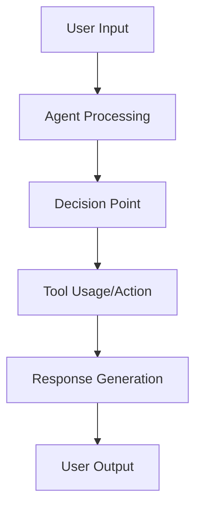

# Agent Evaluation Specification: [AGENT NAME]

**Branch**: `[###-eval-pipeline]` | **Date**: [DATE]  
**Agent Path**: [Path to agent code/repository]  
**User Query**: "$ARGUMENTS" *(designing context if provided)*
**Spec Path**: `eval/spec.md`

**Note**: This template is filled in by the `/evalkit.design` command. See `.evalkit/templates/commands/design.md` for the execution workflow.

## Agent Analysis & Overview *(mandatory)*

<!--
  IMPORTANT: Agent analysis should be PRIORITIZED as evaluation areas ordered by importance.
  Each evaluation area must be INDEPENDENTLY TESTABLE - meaning if you implement just ONE of them,
  you should still have a viable evaluation that delivers meaningful insights.
  
  Assign priorities (P1, P2, P3, etc.) to each area, where P1 is the most critical.
  Think of each area as a standalone slice of evaluation that can be:
  - Evaluated independently
  - Tested independently
  - Reported independently
  - Demonstrated to stakeholders independently
-->

### Agent Architecture & Capabilities

**Agent Type**: [e.g., Conversational, RAG, Tool-using, Code generation]  
**Input/Output Formats**: [Describe data types and interaction patterns]  
**Key Functions**: [List primary capabilities and decision points]  
**Available Tools**: [If applicable, list tools the agent can use]  
**Technology Stack**: [Languages, frameworks, dependencies] 

**Agent Workflow Diagram**:

*Note: Replace the generic workflow above with your agent's specific flow, showing key decision points, tool usage, and data transformations.*

### Evaluation Area 1 - [Brief Title] (Priority: P1)

[Describe this evaluation focus in plain language]

**Why this priority**: [Explain the value and why it has this priority level]

**Independent Test**: [Describe how this can be evaluated independently - e.g., "Can be fully tested by [specific scenarios] and delivers [specific insights]"]

**Metrics**:

1. **Metric**: [specific measurement], **Method**: [how to measure]
2. **Metric**: [specific measurement], **Method**: [how to measure]

---

### Evaluation Area 2 - [Brief Title] (Priority: P2)

[Describe this evaluation focus in plain language]

**Why this priority**: [Explain the value and why it has this priority level]

**Independent Test**: [Describe how this can be evaluated independently]

**Metrics**:

1. **Metric**: [specific measurement], **Method**: [how to measure]
2. **Metric**: [specific measurement], **Method**: [how to measure]

---

### Evaluation Area 3 - [Brief Title] (Priority: P3)

[Describe this evaluation focus in plain language]

**Why this priority**: [Explain the value and why it has this priority level]

**Independent Test**: [Describe how this can be evaluated independently]

**Metrics**:

1. **Metric**: [specific measurement], **Method**: [how to measure]
2. **Metric**: [specific measurement], **Method**: [how to measure]

---

[Add more evaluation areas as needed, each with an assigned priority]

### Edge Cases & Failure Modes

<!--
  ACTION REQUIRED: The content in this section represents placeholders.
  Fill them out with the right edge cases for agent evaluation.
-->

- What happens when [agent receives ambiguous input]?
- How does agent handle [out-of-scope requests]?
- What occurs during [API failures or timeouts]?

## Evaluation Requirements *(mandatory)*

<!--
  ACTION REQUIRED: The content in this section represents placeholders.
  Fill them out with the right evaluation requirements.
-->

### Functional Requirements

- **ER-001**: Evaluation MUST [specific capability, e.g., "measure response accuracy on test scenarios"]
- **ER-002**: Evaluation MUST [specific capability, e.g., "track execution time for all queries"]  
- **ER-003**: System MUST be able to [key measurement, e.g., "detect tool usage patterns"]
- **ER-004**: Evaluation MUST [data requirement, e.g., "store results for comparative analysis"]
- **ER-005**: System MUST [behavior, e.g., "log all agent interactions and responses"]

*Example of marking unclear requirements:*

- **ER-006**: Evaluation MUST measure quality via [NEEDS CLARIFICATION: quality metric not specified - accuracy, relevance, faithfulness?]
- **ER-007**: System MUST retain evaluation data for [NEEDS CLARIFICATION: retention period not specified]

### Key Test Scenarios *(include if evaluation involves specific test cases)*

- **[Scenario Type 1]**: [What it tests, key characteristics without implementation]
- **[Scenario Type 2]**: [What it tests, relationships to other scenarios]

